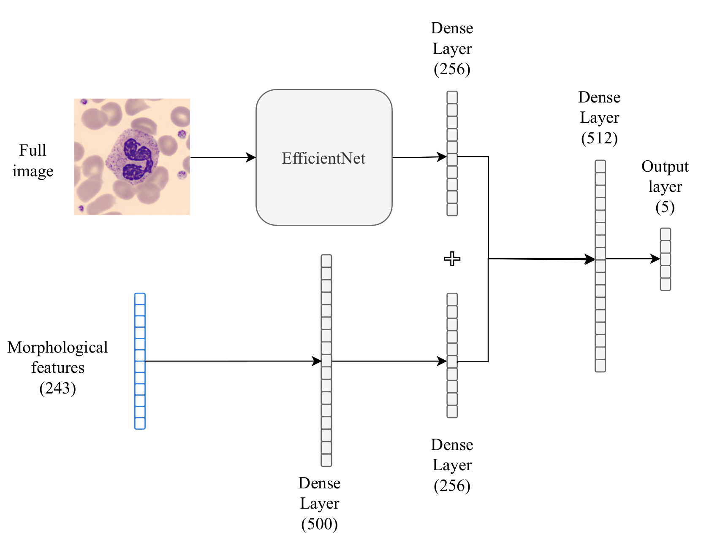
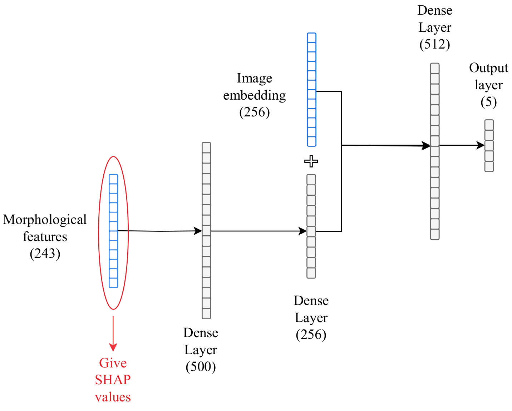

# Improving Interpretability of Leucocyte Classification with Multimodal Network

This repository provides a multimodal model to predict WBC classes from images and morphological features. It contains a segementation module, feature extraction module, classification module, and interpretation module with te usage of SHAP values.

## Abstract
White blood cell classification plays a key role in the diagnosis of hematologic diseases. Models can perform classification either from images or based on morphological features. Image-based classification generally yields higher performance, but feature-based classification is more interpretable for clinicians. In this study, we employed a Multimodal neural network to classify white blood cells, utilizing a combination of images and morphological features. We compared this approach with image-only and feature-only training. While the highest performance was achieved with image-only training, the Multimodal model provided enhanced interpretability by the computation of SHAP values, and revealed crucial morphological features for biological characterization of the cells.

## Architecture


## Interpretability with SHAP values computation


## Requirements

To install the project dependencies, run:

```bash
pip install -r requirements.txt
```
## Repository Structure : 

```
├── src
│   └── data/  # loads data and create data loaders  
│   └── features/ # extracts geometric, color, and texture features from mask and save them
│   └── segmentation/ # creates masks for images from three datasets. Compute IoU with the test ground truth.
│   └── interpretation/ # computes SHAP values from model for three datasets.
│   └── extract_mask_and_features.py # for all images creates masks, extract features and store them.
│   └── train_eval.py # Performs multimodal classification
│   └── compute_plot_shap.py # Computes shap values of multimodal network
│   └── config.py # Config file
├── data/ # Folder for the data
├── models/ # folder for the models
├── out/ # folder for the result reports  
└── README.md                 

```